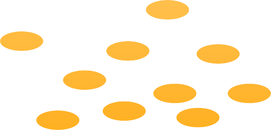
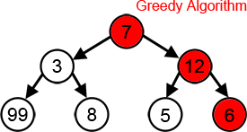
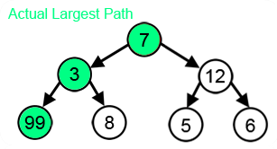
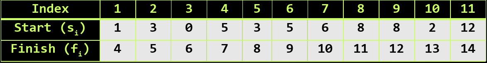
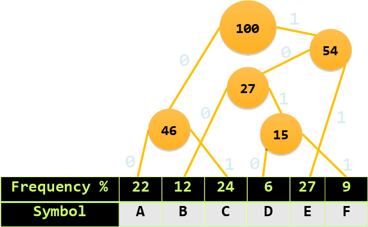

<!-- section start -->
<!-- attr: { class:'slide-title', showInPresentation:true, hasScriptWrapper:true } -->
# Greedy Algorithms and Heuristics
##  Optimization problems, Greedy Algorithms, Optimal Substructure and Greedy choice
<div class="signature">
    <p class="signature-course">Data Structures and Algorithms</p>
    <p class="signature-initiative">http://academy.telerik.com </p>
    <a href="https://telerikacademy.com" class="signature-link">https://telerikacademy.com</a>
</div>

<!-- section start -->
<!-- attr: { showInPresentation:true, style:'' } -->
# Table of Contents
- [Optimization Problems](#optimization)
- [Greedy Algorithms and Failure Cases](#greedyAlgorithms)
- [Optimal Greedy Algorithms](#optimalGreedyAlgorithms)
  - [Optimal Substructure and Greedy Choice](#optimalGreedyAlgorithms)
  - [Demo: Proving Optimality of a Greedy Solution](#demoGreedy)
- [The Set Cover Problem](#setCover)
- [Notable Greedy algorithms](#notableGreedy)

<!-- section start -->
<!-- attr: { class:'slide-section', showInPresentation:true, style:'' } -->
<!-- # Optimization Problems
##  Not "just" Looking for a Solution -->

<!-- attr: { id:'optimization', showInPresentation:true, style:'' } -->
# <a id="optimization"></a>Optimization Problems
- Finding the best solution of a problem
  - From all solution candidates
  - i.e. most optimal solution candidate
  - Not just any solution
- Two categories - based on variables
  - Continuous - variable values are continuous
  - Discrete - a.k.a. Combinatorial

<!-- attr: { showInPresentation:true, style:'' } -->
<!-- # Optimization Problems -->
- Importance of optimization problems
  - Optimal solutions reduce cost
  - Optimal solutions are more likely to be realistically possible
- E.g. finding any route between to a city
  - In theory enables getting there
  - In practice it might be too long to travel
  - Finding the shortest route is much better

<!-- section start -->
<!-- attr: { class:'slide-section', showInPresentation:true, style:'' } -->
<!-- # Greedy Algorithms
##  Picking Locally Best Solution -->

<!-- attr: { id:'greedyAlgorithms', showInPresentation:true, style:'' } -->
# <a id="greedyAlgorithms"></a>Greedy Algorithms
- Greedy algorithms are a category of algorithms
  - Can solve some optimization problems
  - Usually more efficient than all other algorithms
    - For the same problems
- Greedy algorithms pick
  - The best solution
  - From their current position & point of view
  - i.e. they make local solutions

<!-- attr: { showInPresentation:true, hasScriptWrapper:true, style:'' } -->
# Greedy Algorithms: Example
- Playing against someone, alternating turns
- Per turn, you can take up to three coins
- Your goal is to have as much coins as possible



<!-- attr: { showInPresentation:true, style:'' } -->
<!-- # Greedy Algorithms: Example -->
- Things to notice in the way you played to win
  - Always take the max number of coins
    - i.e. make the current optimal solution
  - You don't consider what the other player does
  - You don't consider your actions' consequences
  - The greedy algorithm works optimally here

<!-- attr: { showInPresentation:true, style:'' } -->
<!-- # Greedy Algorithms -->
- A greedy algorithm solves a problem in steps
  - At each step
    - Algorithm picks the best action available
    - Best action is determined regardless of future actions or states
  - i.e. greedy algorithms assume
    - Always choosing a local optimum
    - Leads to the global optimum

<!-- attr: { showInPresentation:true, style:'' } -->
<!-- # Greedy Algorithms -->
- Main components of a Greedy algorithm
  - A candidate set
  - A selection function
  - A feasibility function
  - An objective function and a solution function
- Basically, a greedy algorithms have
  - A set of possible actions
  - A way to pick the best action at a time
  - A way to determine the solution is reached

<!-- attr: { showInPresentation:true, style:'' } -->
<!-- # Greedy Algorithms -->
- Greedy algorithms exploit problem structure
  - E.g. where the solution is the sum of the optimal solutions to subproblems
  - E.g. where greedy choices don't lead to bad overall positions
- Many currency systems' denomination units are suited to greedy processing
  - Ironic, isn't it?

<!-- attr: { showInPresentation:true, style:'' } -->
<!-- # Greedy Algorithms: Example -->
- Consider the US currency denominations
- Problem: gather a sum of money, using the least possible number of bills/coins
  - Suppose you have infinite supplies of each denomination

```
1¢, 5¢, 10¢, 25¢, 50¢, 1$
```

- Sum to make: `1.29$`

```
1$, 25¢, 1¢, 1¢, 1¢, 1¢
```

<!-- attr: { showInPresentation:true, style:'font-size:0.8em' } -->
<!-- # Greedy Algorithms: Example -->
- Greedy algorithm to make a sum
  - With minimum number of coins
  - Given the US currency system
    - This will work for most **1-2-5** series based systems
- We want to achieve the sum `S`
- We start with the sum `Q = 0`
- We have a set of coins `C = { 1, 5, 10 … }`
- At each step:
  - Pick the largest value `V` from `C` such that `Q + V` is **less than or equal** to `S`
  - Increase `Q` by `V` - i.e. add a coin of value `V`
  - Repeat until `Q == S`
  - The number of repetitions is the number of needed coins

<!-- attr: { class:'slide-section demo', showInPresentation:true, style:'' } -->
<!-- # Greedy for Sum of Coins
##  [Demo]() -->

<!-- attr: { showInPresentation:true, hasScriptWrapper:true, style:'font-size:0.9em' } -->
# Greedy Failure Cases
- Greedy algorithms are **often not optimal**
  - Even can reach the unique worst possible solutions for some problems
  - Example: Largest sum path (starting at top)
  - Example: Coin denominations `4`, `10`, `25`
    - Greedy will fail to make the sum `41` which is `25 + 4 x 4`




<!-- section start -->
<!-- attr: { class:'slide-section', showInPresentation:true, style:'' } -->
<!-- # Optimal Greedy Algorithms
##  Optimal Substructure, Greedy Choice Property, Proving Optimality of a Greedy Approach -->

<!-- attr: { id:'optimalGreedyAlgorithms', showInPresentation:true, style:'' } -->
# <a id="optimalGreedyAlgorithms"></a>Optimal Greedy Algorithms
- Suitable problems for greedy algorithms often have these properties:
  - Greedy choice property
  - Optimal substructure
- Any problem having the above properties
  - Guaranteed to have an optimal greedy solution
- **Matroids** - way to prove greedy optimality
  - If a problem has the properties of a **matroid**, it is guaranteed to have an optimal greedy solution

<!-- attr: { showInPresentation:true, style:'' } -->
<!-- # Optimal Greedy Algorithms -->
- Greedy choice property
  - An optimal solution to the problem begins with a greedy choice
  - Subproblems that arise can be solved by consequent choices
    - Also enforced by optimal substructure

<!-- attr: { showInPresentation:true, style:'' } -->
<!-- # Optimal Greedy Algorithms -->
- Optimal substructure
  - After each greedy choice
  - The problem remains an optimization problem
  - Of the same form as the original problem
  - i.e. the optimal solution to the problem contains optimal solutions to the subproblems

<!-- section start -->
<!-- attr: { class:'slide-section', showInPresentation:true, style:'' } -->
<!-- # Solving a Problem Optimally with Greedy
##  Greedy for the Activity Selection Problem and Proving its Optimality -->

<!-- attr: { id:'demoGreedy', showInPresentation:true, style:'' } -->
# <a id="demoGreedy"></a>Proving Greedy Optimality
- The Activity Selection Problem (a.k.a. Conference Scheduling Problem)
  - Given a set of activities `S = {a1, a2, … an}`
    - Each with a start & finish time: `ai = (si, fi)`
  - Activities are "compatible" if they don't overlap
    - i.e. their intervals do not intersect
  - What is the maximum-size subset of compatible activities?
    - i.e. which is the largest list of compatible activities that can be scheduled

<!-- attr: { showInPresentation:true, hasScriptWrapper:true, style:'' } -->
<!-- # Proving Greedy Optimality -->
- The Activity Selection Problem
  - Can have several optimal solutions
    - In the following case `{a1, a4, a8, a11}` is optimal
    - Another optimal is `{a2, a4, a9, a11}`



<!-- attr: { showInPresentation:true, style:'' } -->
<!-- # Proving Greedy Optimality -->
- A greedy algorithm for the task:
- Greedy characteristic of above algorithm
  - Taking the earliest finish activity gives more time for other activities
  - i.e. choose the "maximum remaining time"
- Select activity with the earliest finish from `S`
- Remove activities in `S` conflicting with selected
  - i.e. non-compatible activities are removed
- Repeat the until no activities remain in `S`

<!-- attr: { showInPresentation:true, style:'' } -->
<!-- # Proving Greedy Optimality -->
- To prove the discussed greedy is optimal
  - Need to prove the problem has a greedy choice property
  - Need to prove the problem has optimal substructure
- Observations
  - If there exists an optimal solution, it is a subset of activities from `S`
  - In any solution, the first activity to start is the first to finish

<!-- attr: { showInPresentation:true, style:'' } -->
<!-- # Proving Greedy Optimality -->
- Let `A` be an optimal solution (subset of `S`)
  - Sort activities in `A` by finish time. Let `k` be the index of the earliest activity in `A`
  - If `k = 1` => `A` begins with a greedy choice
  - If `k != 1` =>
    - Let `B = (A - {k}) + {1}`. Prove B is optimal:
    - `f1 <= fk` (from sorting and `k > 1`) => `f1` doesn't overlap any activity in `B`, so `B` is a solution
    - `B` has the same size (number of activities) as `A`
      - Hence, `B` is also optimal

<!-- attr: { showInPresentation:true, style:'' } -->
<!-- # Proving Greedy Optimality -->
- So far we proved that:
  - A solution starting with a greedy choice exists
  - The greedy choice solution is also optimal
- Hence we proved the problem exhibits the `greedy choice property`
  - There exists an optimal solution, starting with a greedy choice
- Now, we need to prove the problem has optimal substructure

<!-- attr: { showInPresentation:true, style:'' } -->
<!-- # Proving Greedy Optimality -->
- We have selected activity 1 (greedy 1st choice)
  - Thus, we reduced to the same problem form
    - Without activities in `S` which intersect activity 1
- If `A` is optimal to `S`, then:
  - `A' = A - {1}` is optimal to `S'` `=` all activities of `S` which start after `f1`
  - Can `A'` be non-optimal to `S'` ?
    - If exists `B'` with more activities than `A'` (from `S'`)
    - Adding activity 1 to `B'` gives `B` with more activities (from `S`) than `A` -> contradiction

<!-- attr: { showInPresentation:true, style:'' } -->
<!-- # Proving Greedy Optimality -->
- We just proved the problem has `optimal substructure`
  - Each greedy choice leads us to a problem of the same form
  - The new problem's solution is a subset of the initial problem's solution
  - i.e. all local solutions joined form the global optimal solution
- We have proven both properties, so our greedy algorithm is optimal

<!-- attr: { class:'slide-section demo', showInPresentation:true, style:'' } -->
<!-- # Activity Selection Problem
##  [Demo]() -->

<!-- section start -->
<!-- attr: { class:'slide-section', showInPresentation:true, style:'' } -->
<!-- # Set Cover Problem
##  Using Greedy for Approximation -->

<!-- attr: { id:'setCover', showInPresentation:true, style:'' } -->
# <a id="setCover"></a>Set Cover Problem
- Greedy algorithms can sometimes find optimal solutions
  - This is not their only application
- There exist problems, for which
  - An optimal solution is to complex to find
  - i.e. calculating an optimal solution is infeasible
  - Sometimes greedy algorithms provide good approximations of the optimal result

<!-- attr: { showInPresentation:true, style:'' } -->
<!-- # Set Cover Problem -->
- The Set Cover Problem (SCP) is such a problem
- SCP formulation:
  - Given a set `{1,2,…,m}` called "the Universe" (`U`)
  - And a set `S{{…},…}` of `n` sets whose union `= U`
  - Find the smallest subset of `S`, the union of which `= U` (if it exists)
  - So, we have a target set, and a set of sets with repeating elements (i.e. redundant elements)
    - How do we find the smallest number of sets, which in union make the target set

<!-- attr: { showInPresentation:true, style:'' } -->
<!-- # Set Cover Problem -->
- The SCP turns out very complex
  - The optimal solution is **NP-complete**
  - i.e. infeasible for calculations (unless **P = NP**)
- However, relatively good solutions can be achieved through a greedy approach:
  - At each step, pick the set containing the largest number of uncovered elements

<!-- section start -->
<!-- attr: { class:'slide-section', showInPresentation:true, style:'' } -->
<!-- # Notable Greedy Algorithms
##  Several Common Greedy Algorithms -->

<!-- attr: { id:'notableGreedy', showInPresentation:true, style:'' } -->
# <a id="notableGreedy"></a>Notable Greedy Algorithms
- Dijkstra's algorithm for finding the shortest path between two vertices
  - in a weighted graph (with no negative cycles)
- At each step, of all reached edges, pick:
  - the one that, along with the path to it, constitutes a minimal sum
- The algorithms is proven optimal
  - Immediately after it reaches a vertex, the path generated to it is guaranteed to be optimal
    - i.e. no need to traverse all vertices

<!-- attr: { showInPresentation:true, style:'' } -->
<!-- # Notable Greedy Algorithms -->
- Prim and Kruskal's algorithms for a minimum spanning tree (MST) are greedy algorithms
  - Prim:
    - pick the smallest edge, not in the MST so far
  - Kruskal:
    - pick the smallest edge, connecting two vertices, not in the same tree
  - Both algorithms have the same complexity

<!-- attr: { showInPresentation:true, hasScriptWrapper:true, style:'' } -->
<!-- # Notable Greedy Algorithms -->
- The prefix tree generation algorithm in Huffman coding is greedy
  - Greedy: pick the two smallest-value leaves/nodes and combine them
  - Left move: `0`, Right move: `1`



<!-- attr: { class:'slide-section', showInPresentation:true, style:'' } -->
<!-- # Huffman Coding
Live Demo -->

<!-- section start -->
<!-- attr: { showInPresentation:true, class:'slide-questions'} -->
<!-- # Questions
## Greedy Algorithms -->

<!-- attr: { showInPresentation:true, style:'' } -->
# References & Further Reading
- The following materials were very helpful in the making of this lecture and we recommend them for further reading:
  - Lecture @ Boston University (Shang-Hua Teng)
    - http://www.cs.bu.edu/~steng/teaching/Fall2003/lectures/lecture7.ppt
  - Lecture @ University of Pennsylvania
    - http://www.cis.upenn.edu/~matuszek/cit594-2005/Lectures/36-greedy.ppt
  - Book on Algorithms @ Berkeley University
    - http://www.cs.berkeley.edu/~vazirani/algorithms/chap5.pdf

<!-- attr: { showInPresentation:true, hasScriptWrapper:true } -->
# Free Trainings @ Telerik Academy
- C# Programming @ Telerik Academy
    - [Data Structures and Algorithms](http://academy.telerik.com/student-courses/programming/data-structures-algorithms/about)
  - Telerik Software Academy
    - [telerikacademy.com](https://telerikacademy.com)
  - Telerik Academy @ Facebook
    - [facebook.com/TelerikAcademy](facebook.com/TelerikAcademy)
  - Telerik Software Academy Forums
    - [forums.academy.telerik.com](forums.academy.telerik.com)
