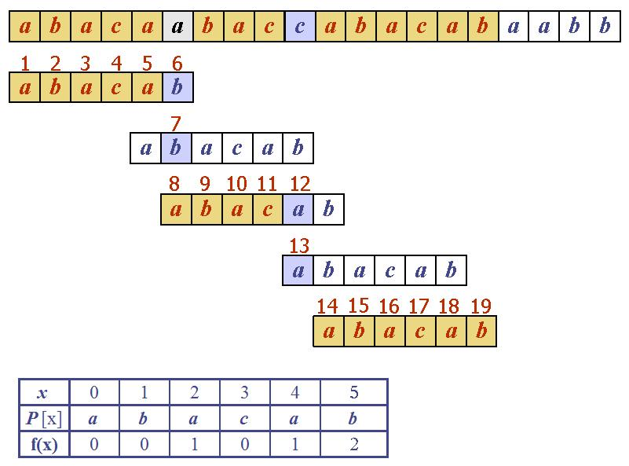

<!-- section start -->
<!-- attr: {id: 'title', class: 'slide-title', hasScriptWrapper: true} -->
# Algorithms on Strings
## Searching

    
Data Structures and Algorithms

    
Telerik Software Academy

    <a href="https://telerikacademy.com" class="signature-link">https://telerikacademy.com</a>

<!-- section start -->
<!-- attr: {id: 'table-of-contents'} -->
# Table of Contents
- Searching algorithms
  - Naive string search
  - Rabin-Karp
  - Knuth-Morris-Pratt
  - Aho-Corasick
  - Suffix trees/arrays

<!-- section start -->
<!-- attr: {class: 'slide-section'} -->
# Searching algorithms
## Naive, hashes, prefix/suffix trees

<!-- section start -->
<!-- attr: {} -->
# Naive search
- Test for match at every possible position
  - Simple but inefficient
  - Quadratic in time (worst case)

<!-- section start -->
<!-- attr: {} -->
# Rabin-Karp
- Uses rolling hash
  - Linear in time
    - Quadratic if you check for collisions
- Capable of multiple pattern search

<!-- attr: {showInPresentation: true} -->
<!-- # Rabin-Karp -->
- The hash of the pattern is computed
- The hashes of each text substring of the same length is computed
  - By rolling the hash
  - Linear in time
- Hash values are numbers
  - Simple to compare

<!-- section start -->
<!-- attr: {hasScriptWrapper: true} -->
# Knuth-Morris-Pratt
- Makes use of previous match info
  - "Partial match" table is precomputed
    - Linear in time
  - Unneeded checks are skipped
  - Linear in time

<!-- section start -->
<!-- attr: {hasScriptWrapper: true} -->
# Aho-Corasick
- Like KMP, but for multiple patterns
  - "Partial match" prefix tree (trie) is precomputed
    - Linear in time
  - Each occurrence of each pattern is found
  - Linear in time
    - There can be quadratic number of occurrences

<!-- section start -->
<!-- attr: {hasScriptWrapper: true} -->
# Suffix trees
- Precompute is done on the text
  - A compressed trie of all suffixes
    - Linear in time using Ukkonen's algorithm
  - Requires a lot of memory to store the tree

<!-- attr: {hasScriptWrapper: true} -->
# Suffix arrays
- Sorted array of all suffixes
  - Represented as indexes
- Building
  - Naive - <code>O(n2\*log(n))</code>
  - Prefix doubling - <code>O(n\*log2(n))</code>
  - Prefix doubling and radix sort - `O(n*log(n))`
  - DFS traversal of a suffix tree - `O(n)`
  - DC3/Skew, others - `O(n)`
- Auxiliary structures
  - LCP array

<!-- section start -->
<!-- attr: {class: 'slide-questions', id: 'questions'}  -->
# Algorithms on Strings
## Questions
