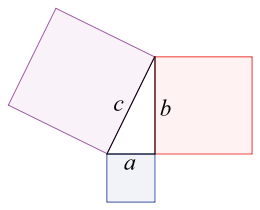
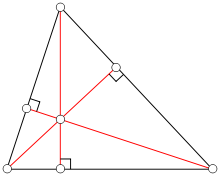
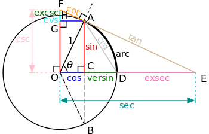

<!-- section start -->
<!-- attr: { class:'slide-title', hasScriptWrapper: true, showInPresentation:true } -->
# Geometry
## Points and lines

    
Data Structures and Algorithms

    
Telerik Software Academy

    <a href="https://telerikacademy.com" class="signature-link">https://telerikacademy.com</a>

<!-- section start -->
<!-- attr: { showInPresentation:true } -->
# Table of Contents
- Points
- Lines
  - Intersection
  - Length of line segment
- Triangles
  - Area
- Trigonometry
- Vectors

<!-- attr: { showInPresentation:true } -->
<!-- # Table of Contents -->
- Algorithms
  - Closest pair of points
  - Convex hull
  - Upper envelope

<!-- section start -->
<!-- attr: { class:'slide-section', showInPresentation:true } -->
# Points

<!-- attr: { showInPresentation:true } -->
<!-- # Points -->
- **Points** have no length, area or volume
- **Point** position can be determined using coordinate system
  - Cartesian
  - Polar
  - ...

<!-- section start -->
<!-- attr: { class:'slide-section', showInPresentation:true } -->
# Lines
## Straight lines

<!-- attr: { showInPresentation:true } -->
<!-- # Lines -->
- **Lines** have no width and represent straight objects
- **Lines** can be defined by
  - Two distinct points - only one lines passes through both of them
  - Polar coordinates
  - One point (with some restrictions)
  - Algebraically with linear equation
    - `y = ax + b`
- In 2D plane lines are either parallel or intersect in a single point

<!-- attr: { showInPresentation:true, hasScriptWrapper:true } -->
<!-- # Lines -->
- A line segment is a finite line
- **Length** can be calculated using the **Pythagorean theorem**
  - <code>a2 + b2 = c2</code>

<!-- section start -->
<!-- attr: { class:'slide-section', showInPresentation:true } -->
# Triangles

<!-- attr: { showInPresentation:true, hasScriptWrapper:true } -->
<!-- # Triangles -->
- **Triangles** have area
- **Triangles** are contained by a single plane
- **Triangles** can be defined by
  - Tree distinct points
  - Length and angles

<!-- attr: { showInPresentation:true } -->
<!-- # Triangles -->
- The area of triangles can be calculated in several ways
  - Using a side and an altitude
    - the most basic formula
  - Using the tree sides
    - Heron's formula
  - Sides and angles
    - Trigonometric formulae
  - Triangle vertex coordinates

<!-- section start -->
<!-- attr: { class:'slide-section', showInPresentation:true } -->
# Trigonometry

<!-- attr: { showInPresentation:true, hasScriptWrapper:true } -->
<!-- # Trigonometry -->
- There are several important functions here
  - Used for obtaining coefficients from angles
  - Relations of sides in a right triangle
- Basic trigonometric functions
  - `sin`
  - `cos`
  - `tg`

<!-- section start -->
<!-- attr: { class:'slide-section', showInPresentation:true } -->
# Vectors

<!-- attr: { showInPresentation:true } -->
<!-- # Vectors -->
- **Vectors** (euclidean vectors) have length and direction
  - Every points can be used as the start of the vector
- **Vectors** can be defined by
  - One point
  - Polar coordinates

<!-- attr: { showInPresentation:true, hasScriptWrapper:true } -->
<!-- # Vectors -->
- **Vectors** support some operations
  - Sum
  - Difference
    - opposite of sum
  - Product of a vector and a number
  - Scalar product (dot product)
  - Vector product (cross product)

<!-- attr: { class:'slide-section demo', showInPresentation:true } -->
<!-- # Solving geometric tasks
## [Demo]() -->

<!-- section start -->
<!-- attr: { class: "slide-questions", hasScriptWrapper:true, showInPresentation:true } -->
<!-- # Geometry
## Questions -->

<!-- attr: { showInPresentation:true, hasScriptWrapper:true } -->
# Free Trainings @ Telerik Academy
- C# Programming @ Telerik Academy
  - [Data Structures and Algorithms](http://academy.telerik.com/student-courses/programming/data-structures-algorithms/about)
- Telerik Software Academy
  - [telerikacademy.com](https://telerikacademy.com)
- Telerik Academy @ Facebook
  - [facebook.com/TelerikAcademy](https://facebook.com/TelerikAcademy)
- Telerik Software Academy Forums
  - [forums.academy.telerik.com](forums.academy.telerik.com)
